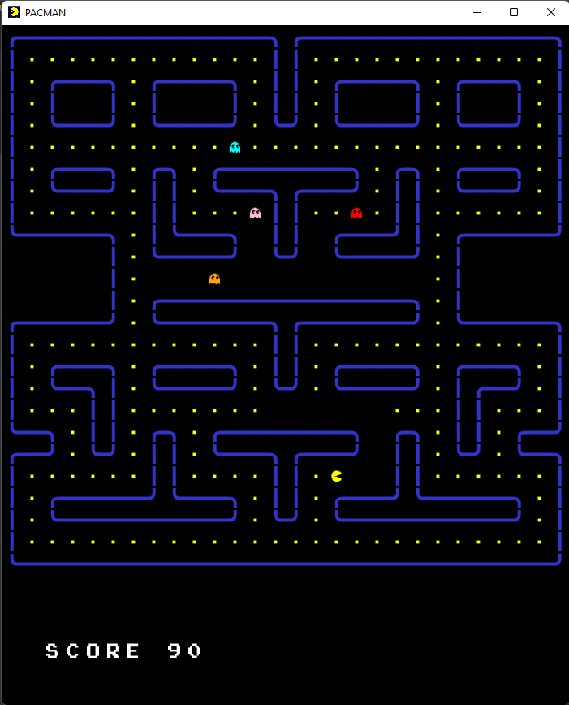
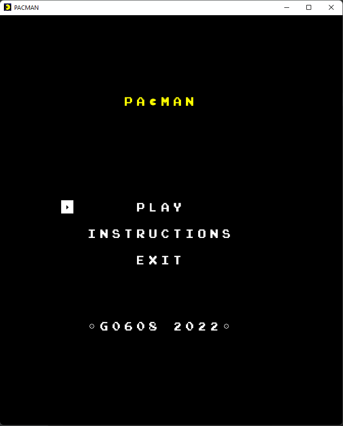

# LDTS_T06_G0608 - PACMAN

## Game Description

Our game is based on a game called Pacman, originally created by NAMCO. Basically, the player is running to get all pellets in a maze while ghosts are chasing him. He wins when there is no more pellet left. If a ghost catches him, he loses.

This project was developed by Vinícius Corrêa (up202001417@fe.up.pt), André Morais (up202005303@edu.fe.up.pt) and Carlota Leite (up202005428@edu.fe.up.pt) for LDTS 2021-22.

## Implemented Features

- **Connected Menus** - The user has the capability of browsing through the different menus including in game ones. (Main Menu, Instructions, Play and Pause).
- **Buttons** - Functional and interactive buttons.
- **Keyboard control** - The keyboard inputs are received through the respective events and interpreted according to the current game state.
- **Player control** - The player moves with the keyboard control.
- **Collisions detection** - Collisions between different objects are verified. (Ex: Player, Ghosts and the Map Walls).
- **Score System** - When the player eats pellets the score increases.
- **Animations** - We incorporated animations for the player and the ghosts and designed the map with a personalized handmade font.
- **Music and Sound Effects** - The game as theme music for every action. (Ex: Start of the Game, Player Moving Eating Pellets, Game Over)
- **Enemies independent Movement** - The ghosts move without the need of any player input.

## Planned Features

- **Smarter Enemy IA** - We inicially implememented an IA that allowed the ghosts to follow the player without crashing into walls but the game became so hard that the player couldn't win. 
- **Powerups** - We started writing the code for the bigger pellets but we didn't implement the mechanics in game because of lack of time.
- All the planned features were successfully implemented except the ones mentioned above.

## Design

### General Structure
#### Problem in Context:
The first concern of our project was how the structure would look like. Since our game is dealling with a GUI and is divided by different States we picked the ones to fullfill our needs in the best way possible.

#### The Pattern:
The two main patterns applied to the project were the **_Architectural Pattern_**, more specifically the Model-View-Controller (Partially implemented) style which is used in a GUI and the **_State Pattern_** which is a behavioral design pattern that lets an object alter its behavior when its internal state changes.  

#### Implementation:
Regarding the implementation, we now have classes which main purpose is to store data (model), we should have classes that control the logic of the game (controllers) but they were left in a single class and classes that are responsible for the visual effects on the screen (viewers).

As for the different states, they are divided with the same methodology as the mvc style, and permite the game to alter its behavior in a simple and efficient way.

#### Consequences:
The use of these patterns in the current design allow the following benefits:
- The several states that represent the different menus become explicit in the code, instead of relying on a series of flags.
- A well organized code acknowledging the Single Responsibility Principle.
- Easy to add new features throughout the development stage.

### GUI
#### Problem in Context:
Aiming for a structured code, we tried to make it as general as possible. The lanterna library contains functions that aren't useful to our program, Interface Segregation Principle violation, and lacks some other functions that our interface needs. Also, if using the raw library, our game (high level module) would be directly depending on a low level module. This is a violation of the Dependency Inversion Principle (DIP). A need to implement an interface that solves these problems was born. 

#### The Pattern: 
We have applied the **_Facade_** pattern. A facade provides a simple interface to a complex subsystem which contains lots of moving parts, allowing us to only include the features that really matter.

These classes can be found in the following files:
- [Game](../src/main/java/com/aor/g608/Game.java)
- [GUI](../src/main/java/com/aor/g608/gui/GUI.java)
- [LanternaGUI](../src/main/java/com/aor/g608/gui/LanternaGUI.java)

#### Consequences: 
The use of the Facade Pattern in the current design allows the following benefits:
- Isolate code from the complexity of a subsystem.
- Promotes testability and replaceability.
- Expand lanterna functionalities as well as respecting the Interface Segregation Principle.

## Known Code Smells And Refactoring Suggestions
#### **Large Class**
Classes like Game and Map contain many fields and the GUI interface and the Map contain many methods. In the case were the Map has a lot of methods thats because we didn't refactored the classes responsible for game movement into the necessary controllers who use those methods, explained futher below. In the other both cases, we find it justifiable as the classes require these fields, in one hand the Game class is the main class of the program and it needs to store a considerable amount of data, on the other hand various methods are needed for the interface and it wouldn't make sense to split it into two separate ones with the extract method.

#### **Feature envy**
As the result of the bad implementacion of the **MVC** (Model-View-Controller) pattern were we did not implement the controllers to the game the Map function (a Model) envies the other models implemented (Ghost, Player, Enemies...) controlling them instead of them being controlled by their own controllers. 

## Testing
We created some of the most important test methods but we did not implement any pitest.

## Self-evaluation

Inicially the work was divided in a mutual way but as the deadline approached we did our best to have everything ready without distribuiting the work equally. We still worked the best we could and we are really proud of our work! It helped us to enrich our java and design pattern, refactoring knwoledge and to work as a team to accomplish our common goal.

- André Morais: 30%
- Carlota Leite: 25%
- Vinícius Corrêa: 45%

